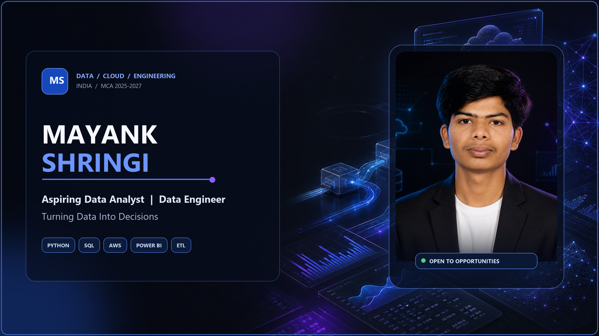
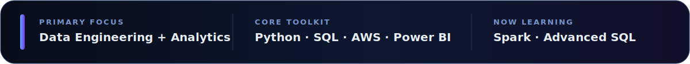
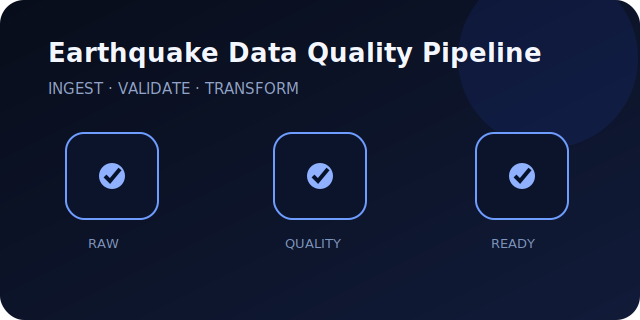
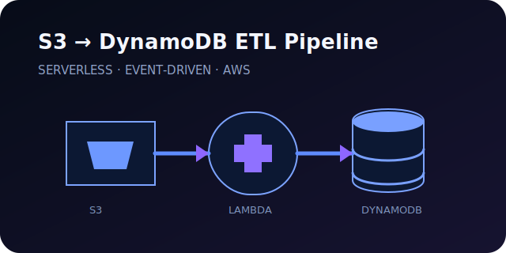
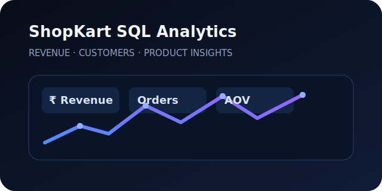
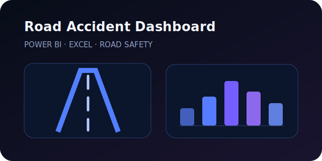
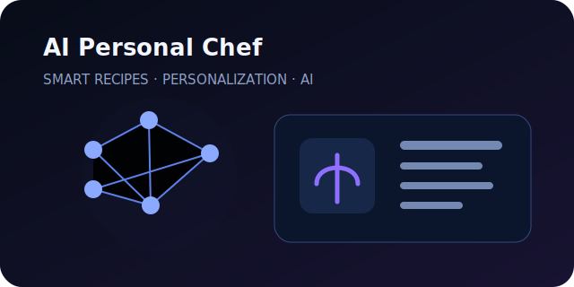
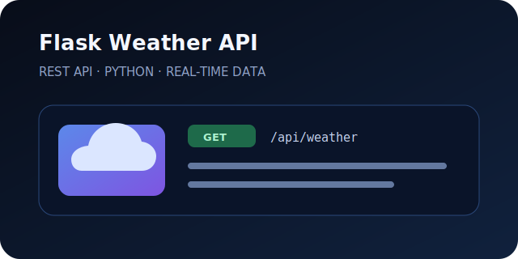

  

  

  
  
  
  

 

  

 

## Turning data into decisions

I’m **Mayank Shringi**, an aspiring Data Analyst and Data Engineer from India, currently pursuing an **MCA (2025–2027)**. I build practical data systems that move from raw input to validated pipelines, clear analysis, and decision-ready output.

My work sits at the intersection of **Python, SQL, AWS, ETL, analytics, and software engineering**—with an emphasis on reliability, clarity, and measurable business value.

## What I build

<table>
  <tr>
    <td width="33%" valign="top">
      <h3>Data pipelines</h3>
      
ETL workflows that ingest, clean, validate, transform, and store data with clear quality checks.

      
<code>Python</code> <code>Pandas</code> <code>AWS</code> <code>ETL</code>

    </td>
    <td width="33%" valign="top">
      <h3>Analytics systems</h3>
      
SQL analysis and BI dashboards that turn complex datasets into understandable business signals.

      
<code>SQL</code> <code>Power BI</code> <code>Excel</code>

    </td>
    <td width="34%" valign="top">
      <h3>Cloud applications</h3>
      
Focused backend and serverless projects connecting APIs, storage, databases, and automation.

      
<code>Lambda</code> <code>S3</code> <code>DynamoDB</code> <code>Flask</code>

    </td>
  </tr>
</table>

## About me

<table>
  <tr>
    <td width="50%" valign="top">
      <h3>Profile snapshot</h3>
      
<strong>Based in:</strong> India

      
<strong>Education:</strong> MCA · 2025–2027

      
<strong>Target roles:</strong> Data Analyst · Data Engineer · Analytics Engineer · BI Developer

      
<strong>Career objective:</strong> Build dependable data products for teams that care about quality, clarity, and useful outcomes.

    </td>
    <td width="50%" valign="top">
      <h3>How I work</h3>
      
<strong>Think:</strong> Start with the business question and define what “useful” looks like.

      
<strong>Build:</strong> Keep transformations readable, modular, and easy to validate.

      
<strong>Verify:</strong> Check data quality, edge cases, and output consistency before presentation.

      
<strong>Communicate:</strong> Explain technical decisions in plain language.

    </td>
  </tr>
</table>

## Tech stack

TOOLS I USE TO MOVE FROM RAW DATA TO RELIABLE OUTPUT

<table>
  <tr>
    <td width="50%" valign="top">
      <h3>Programming & web</h3>
      

        
      

      

        
      

    </td>
    <td width="50%" valign="top">
      <h3>Data analytics</h3>
      

        
        
        
        
        
      

    </td>
  </tr>
  <tr>
    <td width="50%" valign="top">
      <h3>Cloud & data engineering</h3>
      

        
      

      

        
        
        
        
        
      

    </td>
    <td width="50%" valign="top">
      <h3>Databases & tools</h3>
      

        
      

      

        
        
        
      

    </td>
  </tr>
</table>

## Featured projects

SELECTED WORK ACROSS DATA QUALITY, CLOUD ETL, SQL, BI, AI, AND APIs

<table>
  <tr>
    <td width="50%" valign="top">
      
      <h3>Earthquake Data Quality Pipeline</h3>
      
Validates, cleans, and transforms earthquake event data into a dependable analytics-ready dataset with explicit quality checks.

      
  

      
      
    </td>
    <td width="50%" valign="top">
      
      <h3>AWS S3 → DynamoDB ETL Pipeline</h3>
      
An event-driven serverless pipeline that ingests objects from S3, transforms records with Lambda, and stores validated data in DynamoDB.

      
  

      
      
    </td>
  </tr>
  <tr>
    <td width="50%" valign="top">
      
      <h3>ShopKart SQL Analytics</h3>
      
Business-focused SQL analysis covering revenue, product performance, customer behavior, and operational trends.

      
  

      
      
    </td>
    <td width="50%" valign="top">
      
      <h3>Road Accident Analysis Dashboard</h3>
      
A decision-oriented dashboard that surfaces casualty patterns, road conditions, time trends, and high-risk categories.

      
  

      
      
    </td>
  </tr>
  <tr>
    <td width="50%" valign="top">
      
      <h3>AI Personal Chef</h3>
      
A personalized recipe assistant that turns available ingredients and preferences into practical meal recommendations.

      
  

      
      
    </td>
    <td width="50%" valign="top">
      
      <h3>Flask Weather API</h3>
      
A clean REST API that fetches and normalizes real-time weather data with predictable responses and error handling.

      
  

      
      
    </td>
  </tr>
</table>

## GitHub analytics

  
  

  

### Contribution graph

  

  
<strong>More analytics</strong> — trophies, contribution snake, and coding activity

   

### GitHub trophies

  

### Contribution snake

  <picture>
    <source media="(prefers-color-scheme: dark)" srcset="https://raw.githubusercontent.com/https://github.com/Mayank830205/https://github.com/Mayank830205/output/github-contribution-grid-snake-dark.svg" />
    <source media="(prefers-color-scheme: light)" srcset="https://raw.githubusercontent.com/https://github.com/Mayank830205/https://github.com/Mayank830205/output/github-contribution-grid-snake.svg" />
    
  </picture>

### WakaTime

  

## Current focus

<table>
  <tr>
    <td width="50%" valign="top">
      <h3>Building now</h3>
      <ul>
        <li>ETL projects with visible data-quality checks</li>
        <li>Advanced SQL analysis for business questions</li>
        <li>AWS workflows across S3, Lambda, IAM, and DynamoDB</li>
      </ul>
    </td>
    <td width="50%" valign="top">
      <h3>Leveling up</h3>
      <ul>
        <li>Distributed data processing with Apache Spark</li>
        <li>Dimensional modeling and analytics engineering</li>
        <li>Clearer technical storytelling through case studies</li>
      </ul>
    </td>
  </tr>
</table>

## Learning roadmap

| Stage | Focus | Outcome |
|---|---|---|
| Now | Advanced SQL, AWS data engineering | Stronger production-minded analytics workflows |
| Next | Apache Spark, dimensional modeling | Scalable processing and analytics-ready models |
| Then | Machine learning foundations | Responsible predictive analysis built on clean data |

## 2026 goals

<table>
  <tr>
    <td width="50%" valign="top">
      <h3>Engineering</h3>
      <ul>
        <li>Ship three end-to-end data engineering projects with documentation and tests</li>
        <li>Build a cloud-native analytics pipeline on AWS</li>
        <li>Strengthen SQL across window functions, optimization, and data modeling</li>
      </ul>
    </td>
    <td width="50%" valign="top">
      <h3>Professional growth</h3>
      <ul>
        <li>Create recruiter-ready case studies explaining technical choices and business impact</li>
        <li>Contribute consistently to collaborative and open-source projects</li>
        <li>Earn verified credentials aligned with cloud and data engineering</li>
      </ul>
    </td>
  </tr>
</table>

## Achievements

<table>
  <tr>
    <td width="33%" valign="top">
      <h3>6 project tracks</h3>
      
Data quality, cloud ETL, SQL analytics, BI dashboards, APIs, and AI-assisted applications.

    </td>
    <td width="33%" valign="top">
      <h3>End-to-end thinking</h3>
      
Hands-on practice across ingestion, transformation, validation, storage, analysis, and presentation.

    </td>
    <td width="34%" valign="top">
      <h3>Continuous growth</h3>
      
Building practical projects alongside formal MCA studies and a focused technical roadmap.

    </td>
  </tr>
</table>

## Certifications

> Actively preparing a certification path around AWS cloud fundamentals, data engineering, SQL, and business intelligence. Verified credentials will be added here as they are earned.

## Let’s connect

I’m open to internships, entry-level roles, collaborations, and thoughtful conversations around data analytics, data engineering, BI, cloud, and software development.

  
  
  

 

  
  
CLARITY · DATA QUALITY · USEFUL OUTCOMES

