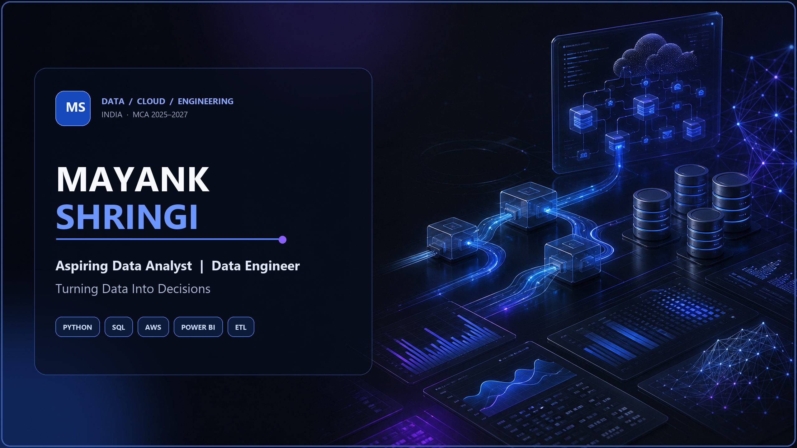

 
# Hi, I'm Mayank Shringi 👋

### Aspiring Data Analyst | Data Engineer

---

# 💫 About Me

Name: Mayank Shringi

Role:
  Aspiring Data Analyst
  Data Engineer

Education:
  MCA (2025–2027)
  CGPA: 9.6 (First Year)

Location:
  India

LeetCode:
  100+ Problems Solved

Focus:
  Data Engineering
  Cloud Computing
  ETL Pipelines
  Data Analytics

Current Learning:
  Apache Spark
  AWS Data Engineering
  Advanced SQL
  Machine Learning

Career Objective:
  Build scalable cloud-native data pipelines
  that transform raw data into reliable,
  business-ready insights.

---

# 🚀 Professional Summary

I'm an aspiring **Data Engineer** with a passion for designing scalable ETL pipelines, cloud-native applications, and analytics solutions.

I enjoy solving real-world business problems using **Python, SQL, AWS, Power BI, and Data Engineering** practices. My focus is on building reliable systems that transform raw datasets into meaningful insights while following clean architecture and production-ready development practices.

> **Building reliable systems, one dataset at a time.**

---

# 🛠 Tech Stack

## Languages

  

## Data Analytics

  

## Cloud & Data Engineering

  

## Databases

  

## Frameworks & Tools

---

# 📚 Currently Learning

| Technology           | Progress  |
| -------------------- | --------- |
| Apache Spark         | 🟦🟦🟦⬜⬜  |
| AWS Data Engineering | 🟦🟦🟦🟦⬜ |
| Advanced SQL         | 🟦🟦🟦🟦⬜ |
| Machine Learning     | 🟦🟦⬜⬜⬜   |

---

# 🎯 Current Focus

* Building production-ready ETL pipelines
* AWS Lambda + S3 + DynamoDB workflows
* Advanced SQL optimization
* Cloud-native Data Engineering
* Power BI dashboards
* Open Source contributions

---

# 🚀 Featured Projects

<table>
<tr>

<td width="50%" valign="top">

## 🌍 Earthquake Data Quality Pipeline

A production-style data engineering project that validates, cleans, transforms, and prepares earthquake datasets for analytics.

### Tech Stack

</td>

<td width="50%" valign="top">

## ☁️ COVID-19 ETL Pipeline

Serverless AWS ETL pipeline using S3, Lambda, and DynamoDB to automate COVID-19 data ingestion and transformation.

### Tech Stack

</td>

</tr>

<tr>

<td width="50%" valign="top">

## 🛒 ShopKart SQL Analytics

Business intelligence project featuring advanced SQL queries, window functions, KPIs, and business insights.

### Tech Stack

</td>

<td width="50%" valign="top">

## 📊 Road Accident Analysis

Interactive Power BI dashboard for accident trends, casualty analysis, road conditions, and decision-making insights.

### Tech Stack

</td>

</tr>

<tr>

<td width="50%" valign="top">

## 🤖 AI Personal Chef

AI-powered meal recommendation system that generates recipes based on available ingredients and user preferences.

### Tech Stack

</td>

<td width="50%" valign="top">

## 🌦 Flask Weather API

REST API built using Flask that fetches weather information and returns structured JSON responses.

### Tech Stack

</td>

</tr>

</table>

---

# 📊 GitHub Analytics

 

---

# 📈 Contribution Graph

---

# 🏆 GitHub Achievements

---

# 🐍 Contribution Snake

>

<picture>

<source
media="(prefers-color-scheme: dark)"
srcset="https://raw.githubusercontent.com/Mayank830205/Mayank830205/output/github-contribution-grid-snake-dark.svg"/>

<source
media="(prefers-color-scheme: light)"
srcset="https://raw.githubusercontent.com/Mayank830205/Mayank830205/output/github-contribution-grid-snake.svg"/>

</picture>

---

# 📈 Profile Overview

---

# 📊 Productivity

---

# 🎯 Current Focus

| 🔥 Currently Building | 🚀 Currently Learning |
|-----------------------|-----------------------|
| Cloud-Native ETL Pipelines | Apache Spark |
| AWS Serverless Applications | Advanced SQL |
| Data Engineering Projects | Data Warehousing |
| Power BI Dashboards | Machine Learning Fundamentals |
| SQL Performance Optimization | AWS Data Engineering |

---

# 🗺️ Learning Roadmap

Python & SQL
      │
      ▼
Advanced SQL & Data Modeling
      │
      ▼
ETL Pipelines
      │
      ▼
AWS (S3 • Lambda • DynamoDB • IAM)
      │
      ▼
Apache Spark
      │
      ▼
Data Warehousing
      │
      ▼
Airflow & Orchestration
      │
      ▼
Production Data Engineering

---

# 💼 Open To Work

---

# 🏅 Achievements

| Achievement | Status |
|------------|--------|
| 🎓 MCA (2025–2027) | ✅ Ongoing |
| 📊 CGPA | **9.6 (First Year)** |
| 💻 LeetCode | **100+ Problems Solved** |
| ☁ AWS ETL Projects | ✅ Completed |
| 📈 Data Analytics Projects | ✅ Completed |
| 🛒 SQL Business Analytics | ✅ Completed |
| 🤖 AI Application Development | ✅ Completed |

---

# 📜 Certifications

> **Completed**

- ✅ PW Skills — Data Science with Generative AI

> **Planned**

- AWS Certified Cloud Practitioner
- AWS Data Engineer Associate
- Microsoft Power BI Data Analyst
- SQL Advanced Certification

---

# 🚀 2026 Goals

| Goal | Progress |
|------|----------|
| Build 15+ Production Projects | 🟩🟩🟩⬜⬜ |
| Master Apache Spark | 🟩🟩⬜⬜⬜ |
| Master AWS Data Engineering | 🟩🟩🟩⬜⬜ |
| 250+ LeetCode Problems | 🟩🟩⬜⬜⬜ |
| Open Source Contributions | 🟩⬜⬜⬜⬜ |
| Land a Data Engineering Role | 🎯 In Progress |

---

# 📚 Beyond Coding

- 📖 Reading about Data Engineering & Cloud Architecture
- 📊 Building Business Intelligence Dashboards
- ☁ Exploring AWS Services
- 🧠 Improving Problem Solving
- 🚀 Building End-to-End Projects
- 💡 Learning New Technologies Every Week

---

# 🤝 Let's Connect

---

# 📄 Resume

---

# 💡 Fun Facts

- ⚡ Passionate about Data Engineering
- ☁ Love building AWS Serverless Applications
- 📈 Enjoy transforming raw data into meaningful insights
- 🚀 Believe in continuous learning through projects
- 🎯 Interested in scalable cloud-native systems

---

# 💬 Quote

## *"Building reliable systems, one dataset at a time."*

---

# ❤️ Thanks for visiting my profile

If you like my work, consider giving a ⭐ to my repositories.

I'm always open to collaborating on exciting Data Engineering, Analytics, and Cloud projects.

---

  

---

### ⭐ Thanks for stopping by! ⭐

**Let's build reliable data systems together.**

